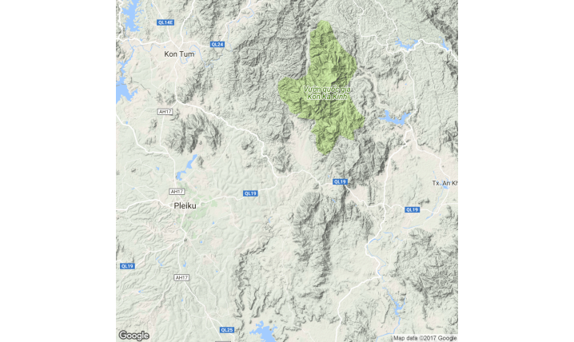
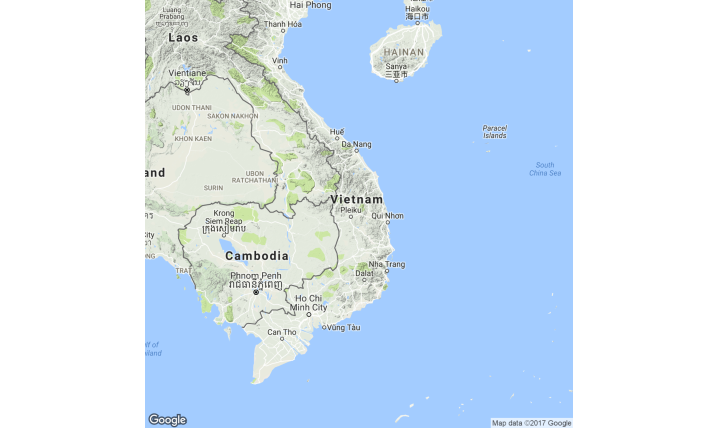

# Geospatial Module

** First, restart your R session.**

- There are multiple packages in R that allow you to "roll your own maps" without expensive and often not available GIS software.  

- These packages also offer functions to enable geospatial analysis and manipulation of spatial data.

- The goal of this module is to demonstrate some simple methods for creating maps and displaying data on maps.

- Geospatial Revolution video: <https://www.youtube.com/watch?v=ZdQjc30YPOk>


## Geospatial Basics

- Geospatial analysis is:
    - The use of data and technology to explore geography and geo problems.
    - Comparing things across space and time.  
    - Taking location into account and leveraging spatial relationships to answer questions.  
    

- Tobler's first law of geography: everything is related to everything else, but near things are more related than far things.

- Maps are:
    - A simplification of reality.
    - A way to display data, tell stories, and influence understanding and decision making.


### Projections

*The earth is round and maps are flat.*

- Projections transform location information from a 3D sphere to a 2D map, preserving some *but not all* attributes.

- Projections use coordinates and coordinate reference systems to do the transformation.

- Different projections can produce different results in geospatial analysis.


Coordinate Reference Systems:

- Coordinate Reference Systems (also called Geodetic Datums) are a coordinate system and a set of reference points used to locate places on Earth by defining the geometric relationship between the coordinate system grid and the Earth's surface. 

- A common datum is WGS84 but there are many others. 


### Coordinate Formats

- A geographic coordinate system is a reference system used to represent any location on Earth within a common geographic framework (such as longitude and latitude) using letters, numbers, or symbols. 

    - Longitude:  East-West from the Prime Meridian, lines go up and down to the poles, not parallel, "x" on the cartisian scale
    
    - Latitude:  North-South from the Equator, parallel lines, "y" on the Cartesian scale


- Some common Coordinate Systems you may be familiar with:

    - Military Grid Reference System (MGRS): 4QFJ 1234 6789

    - Decimal Degrees(DD): 38.8897, -77.0089

    - Degrees, Minutes, Seconds(DMS): 38° 53' 23" N, 77° 00' 32" W


- You can mathematically convert between between coordinate systems using the *conv_units()* function in the **measurements** package.


### Spatial Data
Spatial data is:

   - Regularly structured data.
   
   - A representation of locations and extents in digital form.  

   
There are two main categories of spatial data:

1. Raster - "grid cells"
    - Cell based, like pixels in imagery
    - Well suited to entities that lack clear boundaries (elevation, vegetation)
  
2. Vector - "connect the dots"
    - Points, like cities
    - Lines, like roads
    - Polygons, like administrative boundaries
    - Well suited to entities with clear boundaries
  

## Packages and Data

First, lets install the packages we will use in this module.
```{r warning=FALSE,comment=FALSE,message=FALSE}
library(raster)
library(ggmap)
library(leaflet)

```


We will use location data from both the "thor_vietnam_65_clean.csv" and "takeoff.csv" datasets.  

```{r}
takeoff <- read.csv("takeoff.csv", stringsAsFactors = FALSE)
nam65 <- read.csv("thor_vietnam_65_clean.csv", stringsAsFactors = FALSE)
```


## Basemaps

Basemaps provide the basic geographic context for geospatial analysis.  The first step for creating a map for geospatial analysis is defining a basemap that will underlay the data.  

We will go over several options for creating basemaps, including shapefiles and online maps.

### Shapefiles
Shapefiles are a popular method of representing geospatial vector data in GIS software. 

- File format was developed by ESRI (a notable GIS Software Company). 

- Stores data in the form of points, lines, or polygons. 

- Used to represent administrative boundaries (think country/state/county borders), roads, rivers, lakes, etc.  


The `getData()` function in the **raster** package allows you to pull geographic data for anywhere in the world.  

- Pulls from an online database. 

- The result is a spatial polygon that can be plotted, forming a basemap just like a shapefile.  

Let's get the Vietnam polygon from the GADM database, which is a collection of global administrative boundaries.  GADM requires you to identify the level of detail you are interested in.  

- Level 0 = country

- Level 1 = first level of subdivision (such as state).   

```{r message = FALSE, warning = FALSE}
vt <- getData('GADM', country = 'Vietnam', level = 0)
plot(vt)
```

Notice that the `getData()` function goes to the internet to pull the shapefile.  It is best to save it to object for easier reference later.  

The object is saved as a SpatialPolygonDataFrame.

### Shapefile Exercise
Get the next level of detail for Vietnam and plot it to compare the two levels.
 
 
 
### Uploading Shapefiles
If you have shapefiles in the Esri format, which is actually a collection of multiple files stored together, you can read them into R with the `readOGR()` function in the **rgdal** package.  

You can download shapefiles at the GADM website, <http://www.gadm.org/>.  You can also download an "R SpatialPolygonsDataFrame", which you can read into R using the `readRDS()` function in the **rgdal** package.


## ggmap

The **ggmap** package pulls base maps from online map servers like Google Maps, OpenStreetMap, or Stamen Maps.  

- `qmap()` function accepts a text location, used to search just like you do at the online map.


```{r eval = FALSE}
qmap(location = "Vietnam")
```



- "zoom" parameter: 3 = continent, 10 = city, 21 = building  (default is 10, max is 21)
```{r eval = FALSE, message = FALSE, warning = FALSE}
qmap(location = "Vietnam", zoom = 6)
```



- "maptype" parameter options include terrain, satellite, roadmap, and hybrid.


### ggmap Exercise

1.  Compare the 4 map types for Fort Belvoir at zoom level 13:  terrain, satellite, roadmap, and hybrid.

2.  Use the coordinates for Fort Belvoir, VA in the location parameter:  38.714668, -77.143600


### Map Distance

Calculate distance using the `mapdist()` function from the **ggmap** package:
```{r message = FALSE, warning = FALSE, eval = FALSE}
mapdist("Washington DC","Fort Belvoir, VA", "driving")
```


### Geocoding
You may have location data that does not include latitudes and longitudes.  But plotting those points requires the lat/longs.  the `geocode()` function in **ggmaps** uses Google Maps to get the lat/longs for text locations, just like as if you were searching in a web browser.

```{r message = FALSE, warning = FALSE}
geocode("Fort Belvoir, VA")
geocode("6001 Goethals Rd, Fort Belvoir, VA")

```

Try geocoding with just a place name, such as "Disney World".

### Takeoff Data
Using the `geocode()` function, we created a dataset with the coordinates of the takeoff locations (not including the ships).

```{r}
takeoff <- read.csv("takeoff.csv", stringsAsFactors = FALSE)
head(takeoff)
```


## Map Layers

Now that we have basemaps, the next step is to add data to the map.  

First, let's create an object that is our basemap.  

```{r warning = FALSE, message = FALSE}
vnmap <- qmap(location ="Vietnam", zoom = 6)
```


### Points

Adding data to the basemap with the **ggmap** package uses layers, similar to **ggplot2**.  

Let's add points for the takeoff locations to the basemap.  Note that "x" should always be mapped to the variable for longitude and "y" mapped to latitude.
```{r warning = FALSE}
vnmap + 
  geom_point(data = takeoff, aes(x = lon, y = lat))
```

Format the points the same way as in **ggplot2**.
```{r warning = FALSE}
vnmap +
  geom_point(data = takeoff, aes(x = lon, y = lat), shape = 15, size = 2, colour = "purple") 
```


## Plot Points Exercise

1.  Subset the "nam65" data set for strike missions.  (Hint: variable MFUNC_DESC)

2.  Plot the strike points on the basemap.

3.  Color the strike points based on the "MILSERVICE" variable.


## Heat Maps
A heat map reflects the concentration of points on the map, also thought of as data density.

- Use the `stat_density2d()` function to create the heat map layer.

- `fill` mapping provides color, `alpha` mapping adjusts the transparency.

- Remove the legend because it doesn't provide useful information: `show.legend = FALSE`

```{r warning = FALSE}
strike <- dplyr::filter(nam65, MFUNC_DESC=="STRIKE")

vnmap + 
  stat_density2d(data = strike, aes(x = TGTLONDDD_DDD_WGS84, y = TGTLATDD_DDD_WGS84, 
                                    fill = ..level.., alpha = ..level..), 
                 geom = "polygon", show.legend = FALSE)
```


## Facet the Maps
You can facet maps just like plots!  

- Use `facet_wrap()` to organize the sub-maps with the same number of rows and columns.

```{r}
vnmap +
  stat_density2d(data = strike, aes(x = TGTLONDDD_DDD_WGS84, y = TGTLATDD_DDD_WGS84,
                                    fill = ..level.., alpha = ..level..),
                 geom = "polygon", show.legend = FALSE) +
  facet_wrap(~ MILSERVICE)
```


## Leaflet

Leaflet is a library for making interactive maps.  The JavaScript version of leaflet is used by many websites and GIS specialists.

Here's a tutorial for leaflet: <http://rstudio.github.io/leaflet/>

### Leaflet Basemaps

Just like **ggplot2**, leaflet creates visualization in layers.

1.  Start with `leaflet()` to create a map widget.

2.  Add a map tiles layer.  The default layer is an OpenStreetMap map, with `addTiles()`.

3.  Use `setView()` to center the map and set the zoom level.

4.  Separate layers with a pipe operator `%>%`, not the plus sign. 

```{r message = FALSE, warning=FALSE, eval=FALSE}
leaflet() %>%
  addTiles() %>%
  setView(lng = 107, lat = 17, zoom = 6)
```

Notice that OpenStreetMap uses the local language on the map, which is not useful for our purposes.  

The `addProviderTiles()` function sets the basemap you want to use, which are also called "providers".  The list of providers that you can reference with leaflet can be found [here](https://leaflet-extras.github.io/leaflet-providers/preview/) and in this case we chose "Esri.WorldTopoMap". 

```{r message = FALSE, warning=FALSE, eval = FALSE}
leaflet() %>%
  setView(lng = 107, lat = 17, zoom = 6) %>%
  addProviderTiles("Esri.WorldTopoMap")

```


### Add Points to Leaflet

Using the strike dataframe, we will add markers on the map for the locations of the strike missions.

- Strike data:  `strike <- dplyr::filter(nam65, MFUNC_DESC=="STRIKE")`

- Use `addCircleMarkers()` to add points to the base map.

- Be sure to add the tilde (~) before the variable names.

- Note:  Leaflet stops plotting points after it hits an NA in the latitude or longitude variable, so be sure to filter out any rows with NAs in the geospatial variables.

```{r message = FALSE, warning=FALSE, eval=FALSE}
leaflet() %>%
  setView(lng = 107, lat = 17, zoom = 6) %>%
  addProviderTiles("Esri.WorldTopoMap") %>%
  addCircleMarkers(data = strike, lng=~TGTLONDDD_DDD_WGS84, lat=~TGTLATDD_DDD_WGS84, 
                   radius = 2)
```


### Add Popups

A great feature of interactive maps is popups that provide information when the user clicks on the marker.  

- Use the "popup" parameter in the `addCircleMarker()` layer.

- We want the popup to show the service that flew the mission.

```{r message = FALSE, warning=FALSE, eval=FALSE}
leaflet() %>%
  setView(lng = 107, lat = 17, zoom = 6) %>%
  addProviderTiles("Esri.WorldTopoMap") %>%
  addCircleMarkers(data = strike, lng = ~TGTLONDDD_DDD_WGS84, lat = ~TGTLATDD_DDD_WGS84, 
                   radius = 2, popup = ~strike$MILSERVICE)

```

You can add multiple fields to the popup by combining them with the `paste()` function like: 

`popup = paste("Service:", strike$MILSERVICE,", ",strike$TAKEOFFLOCATION)`


## Saving Maps
You can save maps to use outside RStudio, ust like other visualizations, by clicking the "Export" dropdown on the "Plots" tab.

Options:
1. Save as Image.
2. Save as PDF.
3. Copy to Clipboard.


To save a leaflet map: 

- Click the "Export" dropdown on the "Viewer" tab.

- Click "Save as a Webpage".  This will create an html file for the leaflet map.

- Name the html file.  It will default to saving in your working directory.

## Leaflet Exercise

1.  Plot the locations of strike missions by the B-57 aircraft on an Esri World Street Map basemap.

2.  Popup the target type and operation supported.


## Customizing Leaflet
### Leaflet Colors and Legends
- To color the points based on another variable, you need to define a palette for that variable and then reference it in the `color` parameter in `addCircleMarkers`.

- Use the `addLegend()` function to add a legend for those colors, again referencing the defined palette.

```{r message = FALSE, warning=FALSE, eval = FALSE}
svc_pal <- colorFactor(c("blue","red","orange","green"), strike$MILSERVICE)

leaflet() %>%
  setView(lng = 107, lat = 17, zoom = 6) %>%
  addProviderTiles("Esri.WorldTopoMap") %>%
  addCircleMarkers(data = strike, lng = ~TGTLONDDD_DDD_WGS84, lat = ~TGTLATDD_DDD_WGS84, 
                   radius = 2, popup = ~strike$MILSERVICE,
                   color = ~svc_pal(MILSERVICE)) %>%
  addLegend(pal = svc_pal, values = strike$MILSERVICE)
```

### Polygon Layers
Add a polygon layer with the `addPolygons()` function.

We will add the provinces of Vietnam to our map using the "vt1" shapefile object we created earlier.

```{r message = FALSE, warning=FALSE, eval=FALSE}
vt1 <- getData('GADM', country = 'Vietnam', level = 1)

leaflet() %>%
  setView(lng = 107, lat = 17, zoom = 6) %>%
  addProviderTiles("Esri.WorldTopoMap") %>%
  addPolygons(data = vt1, fillOpacity = .1, color = "purple")

```


### Layer Control
If you have multiple layers on a map, you can add the functionality to turn them on and off with the `addLayersControl()` function.  You must identify each layer you want to control with a `group` parameter in the layer information.

We will add the circle markers back onto the map along with the layers control.

```{r message = FALSE, warning=FALSE, eval=FALSE}
leaflet() %>%
  setView(lng = 107, lat = 17, zoom = 6) %>%
  addProviderTiles("Esri.WorldTopoMap") %>%
  addCircleMarkers(data = strike, lng = ~TGTLONDDD_DDD_WGS84, lat = ~TGTLATDD_DDD_WGS84, 
                   radius = 2, popup = ~strike$MILSERVICE, group = "Strike") %>%
  addPolygons(data = vt1, fillOpacity = .1, color = "purple", group = "Province") %>%
  addLayersControl(overlayGroups = c("Strike","Province"))
```


## Leaflet Strikes Exercise
1.  Create a map of strikes with layer control and different colors for each military service.

2.  Hint: subset by service.


